<div align="center">
  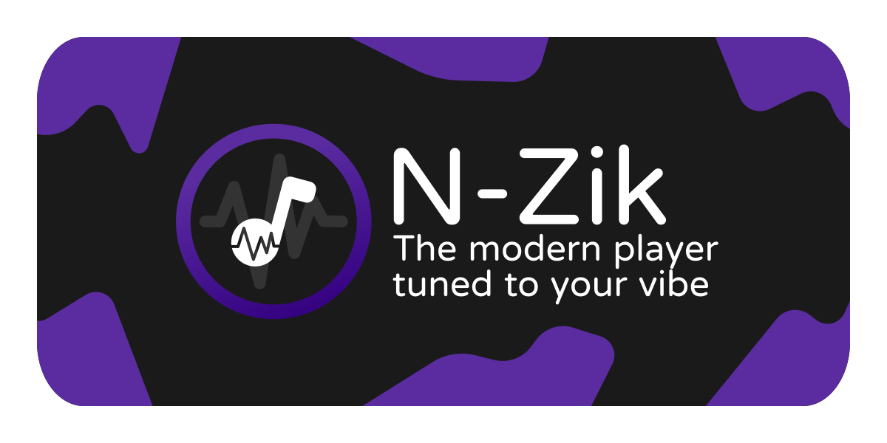    
  
  <h3>🌐 <a href="https://n-zik.vercel.app/">Official Website</a></h3>

  <p>
    <b>N-Zik</b> is a multilingual fork of <a href="https://github.com/knighthat/Kreate">Kreate</a>, 
    built with performance improvements, UI/UX refinement, bug fixes, and new features in mind with long-term support.
  </p>
  <p>
    <strong>N-Zik</strong> may not yet be as stable as the original 
    <a href="https://github.com/knighthat/Kreate">Kreate</a>, so feel free to use the original 
    if you need a more mature alternative.
  </p>
  <p>
    <strong>N-Zik</strong> is a side project I originally built for myself and friends, not chasing glory. 
    It's grown a bit since then, which is cool.
  </p>
  <p>
    I use generative AI to assist with code, structured with the 
    <a href="https://github.com/bmad-code-org/BMAD-METHOD">BMAD Method</a>, 
    but everything gets reviewed and tested before it's pushed. I'm not shipping blind.
  </p>
  <p>
    If AI-assisted development isn't your thing, no hard feelings, 
    there are plenty of great alternatives.
  </p>

  
  <br>
  
</div>

<div align="center">
  
  
  
 <br> <br> 

[](https://crowdin.com/project/N-Zik) [](https://www.gnu.org/licenses/gpl-3.0)
[](https://www.codefactor.io/repository/github/N-Zik-Group/n-zik)
[](https://devglobe.app/projects/n-zik?utm_source=badge&utm_medium=embed)

</div>

---

<div align="center">


<br>
<br>
<br>

<h1>⏳ Only <a href="https://keepandroidopen.org"></a> days remaining until Android Lockdown</h1>

Starting in **September 2026**, Google will require **identity verification for all Android developers**, including those distributing applications **outside of Google Play**.


As a **Free and Open Source Software (FOSS)** project, **N‑Zik** and his **developer** opposes this requirement due to its impact on developer privacy, independent distribution, and software freedom.

📖 [Learn more](https://keepandroidopen.org) · ✍️ [Sign the petition](https://www.change.org/p/stop-google-from-limiting-apk-file-usage/)

</div>
<br>
<br>

<div align="center">

## 📚 Wiki

[](https://deepwiki.com/N-Zik-Group/N-Zik)

<br>

## 🌍 Community

Join the N-Zik Discord:

[](https://discord.gg/bneHC7QRje)

<br>

</div>

# 🎧 Features

- 🌍 **Multilingual Support** – Available in English, Italian, German, Russian, French, Spanish, Czech, Turkish, Romanian, and more. Contributions are always welcome!
- 🎨 **Modern and Intuitive UI**
- 🌓 **UI Mode Toggle** – Switch between the **N-Zik** experience and the classic **ViMusic** interface.
- 💾 **Smart Offline Caching** – Automatically cache songs for offline playback with customizable cache limits.
- 📥 **Downloads** – Download individual tracks or entire playlists for permanent offline access.
- ▶️ **Background Playback** – Keep your music playing while using other apps.
- 📊 **Listening Statistics** – Track your habits, favorite artists, and playback trends.
- ⬇️ **OTA Updates** – Receive automatic in-app updates without needing to reinstall manually.
- 🌈 **Audio Visualizer** – Enjoy real-time visual effects synchronized with your music.

> [!NOTE]
> 🎤 The audio visualizer requires **microphone permission** and must be enabled in the settings.

- 🕹️ **Discord Rich Presence** – Display your currently playing track directly on your Discord profile.

<p align="left">
    <br>
  

</p>

- 📰 **News Feed** – Explore moods, genres, releases, and albums from your favorite artists.
- 🔄 **Playlist Import & Export** – Easily back up, share, and restore playlists.
- ✍️ **Advanced Lyrics Support** – Fetch, display, edit, synchronize, and translate lyrics.
- 🎭 **Custom Themes** – Personalize the app with multiple theme options.
- ⏲️ **Sleep Timer** – Automatically stop playback after a configurable duration.
- 🎚️ **Advanced Audio Controls** – Adjust volume, playback speed, pitch, normalization, silence skipping, crossfade, volume boost and silence skipping.
- 📺 **Wide Platform Support** – Compatible with Android Auto, Android Automotive, Android TV, and YouTube video playback.
- 🧪 **Experimental Widgets** – Access upcoming features before they become stable.
- 📤 **Media Export** – Export cached or downloaded music to external storage.
- ⚙️ **Settings Backup & Restore** – Save and restore your complete app configuration.
- 📡 **Offline First** – Enjoy your music library even without an internet connection.
- ▶️ **YouTube Integration (Early Access)** – Recommendations and profile-related content are already synchronized from your YouTube account. Full synchronization is currently in development.

# 📷 Screenshots

<div align="center">
    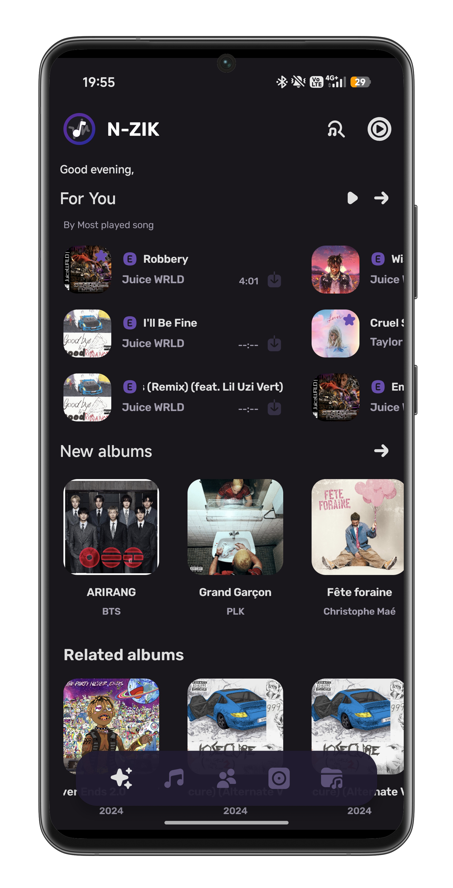
    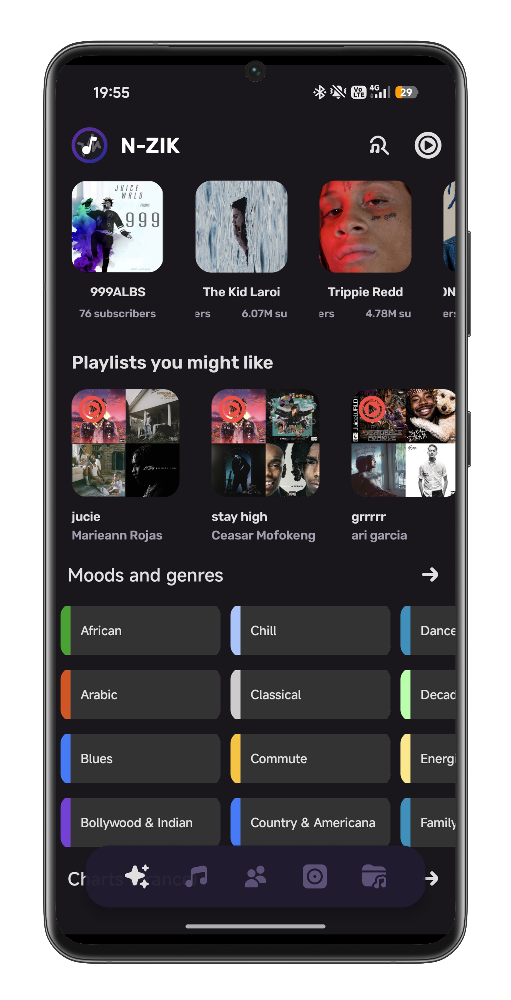
    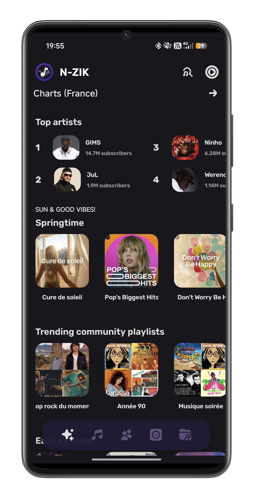
    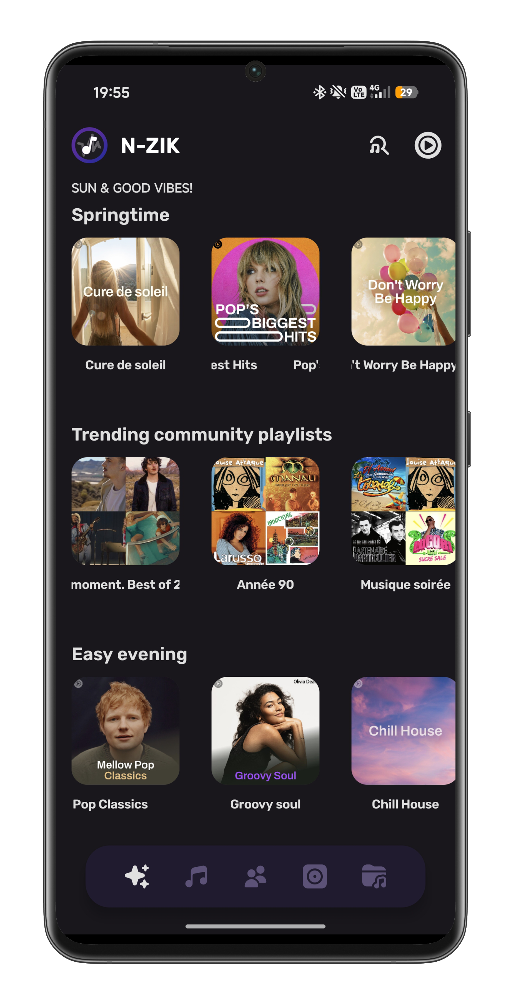
    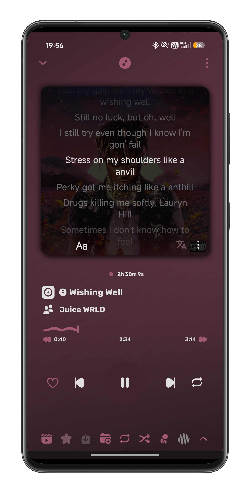
    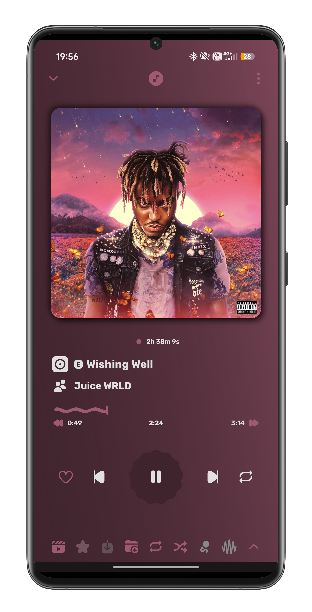
    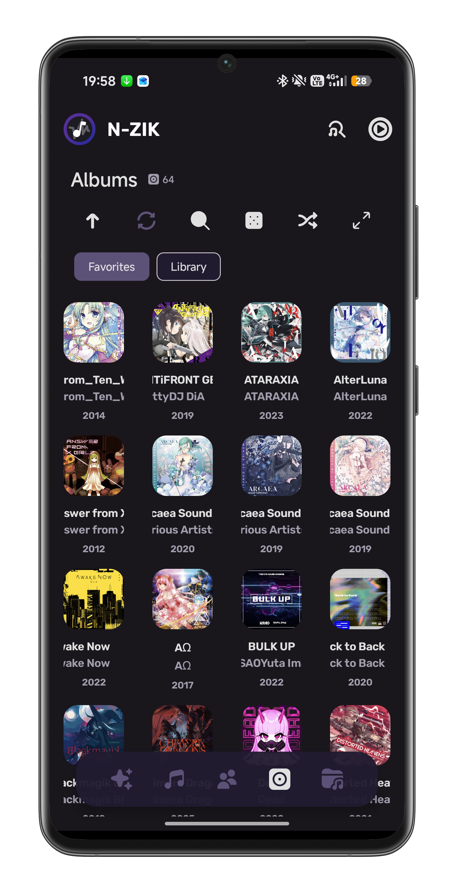
    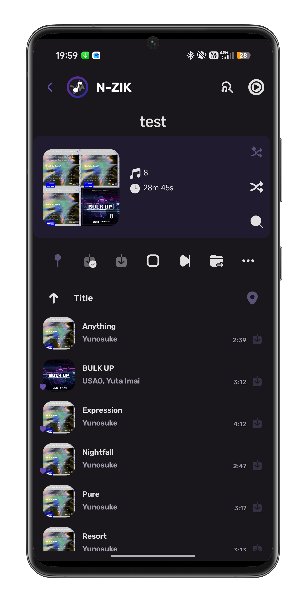
    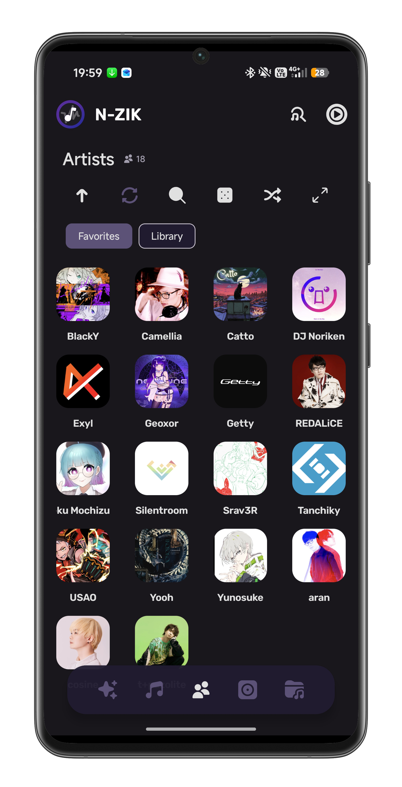
    
    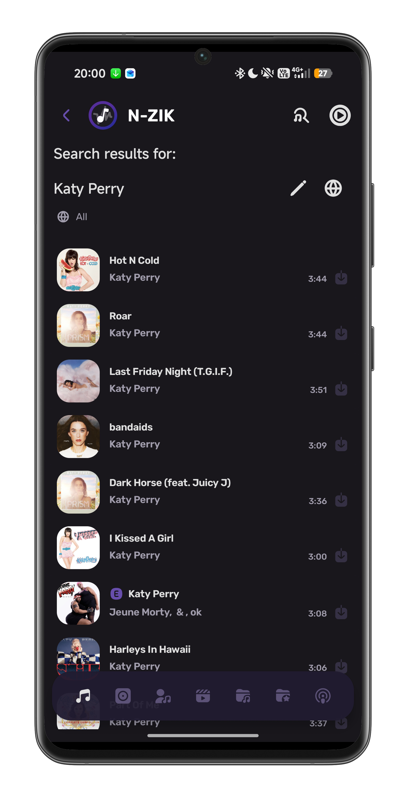
    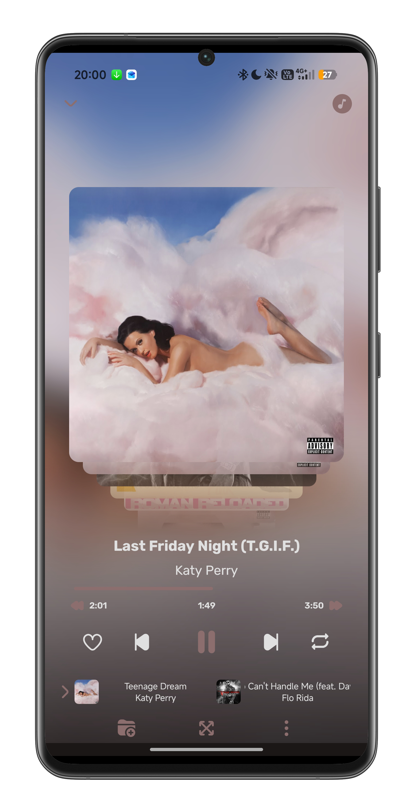
    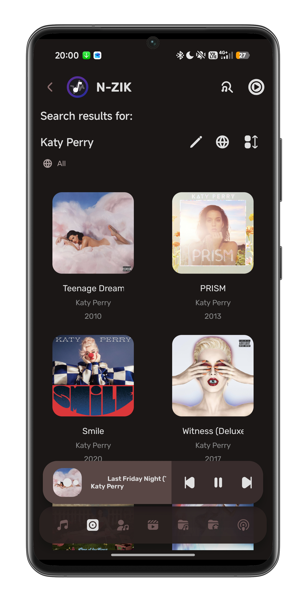
    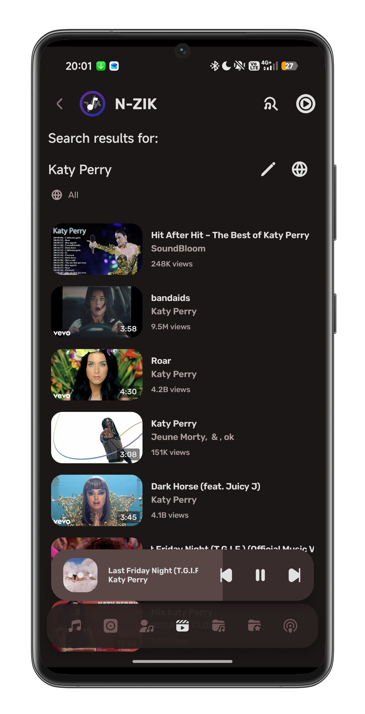
    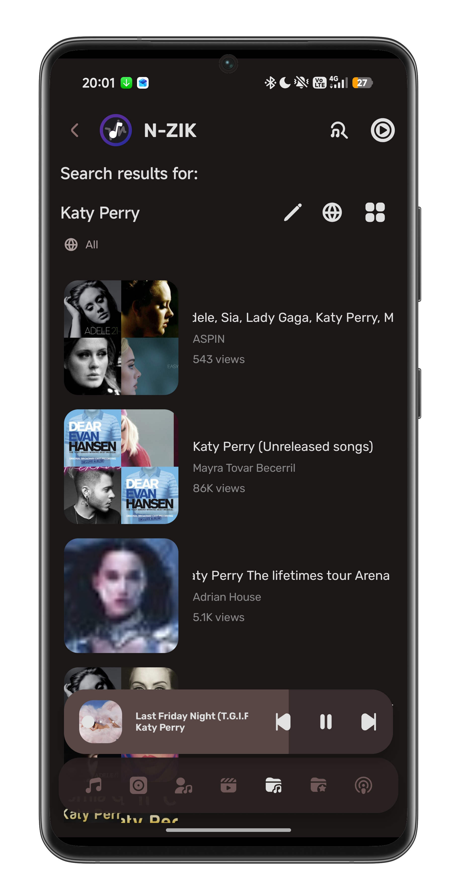
    
    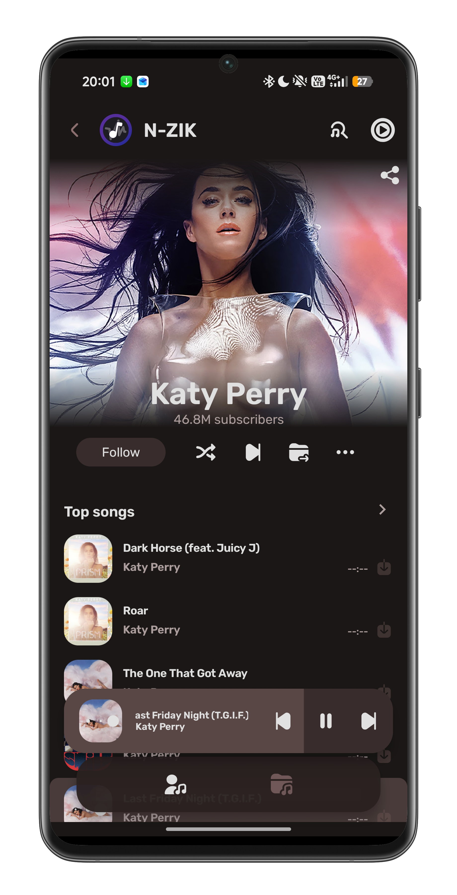
    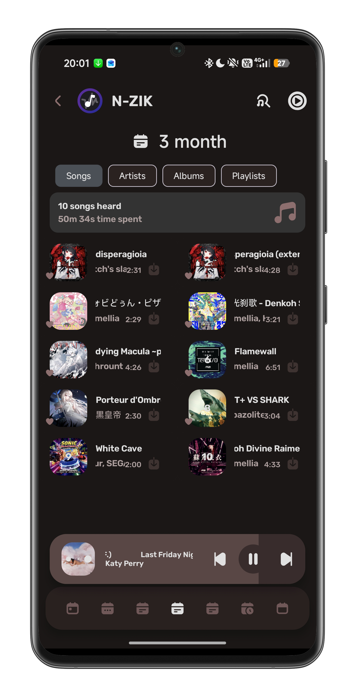
    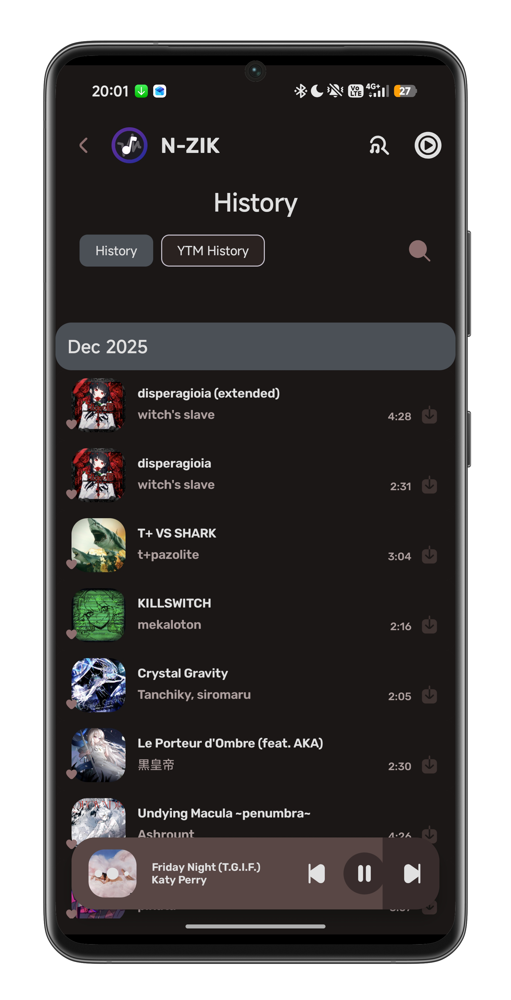
    
    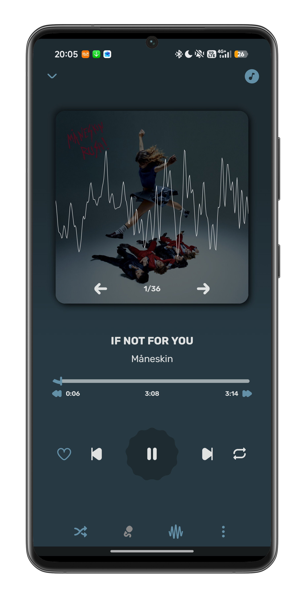
</div>

# 🌐 Supported Languages

Thanks to all our amazing contributors!  
Here are the languages currently supported:

- 🇿🇦 **Afrikaans** — [HelloZebra1133](https://crowdin.com/profile/HelloZebra1133)
- 🇸🇦 **Arabic** — [ABS zarzis](https://crowdin.com/profile/abszar), [Ahmad Al Juwaisri](https://crowdin.com/profile/juwaisri)
- 🇦🇿 **Azerbaijani** — [Nizami Səmidov](https://crowdin.com/profile/nizamismidov4), [Notesuree](https://github.com/Notesuree)
- 🇧🇩 **Bangla** — [Ann Naser Nabil](https://github.com/AnnNaserNabil)
- 🇷🇺 **Bashkir** — [Shilave malay](https://crowdin.com/profile/Bash.boy)
- 🇪🇸 **Catalan** — [Adrià Martínez](https://crowdin.com/profile/marxally), [Aniol](https://crowdin.com/profile/aniol), [EMC_Translator](https://crowdin.com/profile/EMC_Translator)
- 🇨🇳 **Chinese (Simplified)** — [benhaotang](https://crowdin.com/profile/benhaotang), [SharkChan0622](https://github.com/SharkChan0622)
- 🇹🇼 **Chinese (Traditional)** — [YeeTW](https://github.com/yjcTW), [SharkChan0622](https://github.com/SharkChan0622)
- 🇨🇿 **Czech** — [ikanakova](https://github.com/ikanakova), [JZITNIK-github](https://github.com/JZITNIK-github)
- 🇩🇰 **Danish** — [cultcats](https://crowdin.com/profile/cultcats)
- 🇳🇱 **Dutch** — [BabyBenefactor](https://crowdin.com/profile/BabyBenefactor)
- 🇺🇸 **English** — [Alejandro Moctezuma](https://crowdin.com/profile/alejandromoc), [twistios](https://crowdin.com/profile/twistios), [Smk90](https://crowdin.com/profile/smk90), [CanIn](https://crowdin.com/profile/canin), [koliwan](https://crowdin.com/profile/koliwan), [Glich440](https://github.com/Glich440), [fast4x](https://github.com/fast4x)
- 🌍 **Esperanto** — [kefiiris](https://github.com/kefiiris)
- 🇪🇪 **Estonian** — [beez276](https://crowdin.com/profile/beez276)
- 🇵🇭 **Filipino** — [Clyde-Timonera](https://github.com/Clyde-Timonera)
- 🇫🇮 **Finnish** — [Smk90](https://crowdin.com/profile/smk90), [rikalaj](https://crowdin.com/profile/rikalaj)
- 🇫🇷 **French** — [Mickael81](https://crowdin.com/profile/mickael81), [esophagusdecency](https://crowdin.com/profile/esophagusdecency), [NEVARLeVrai](https://github.com/NEVARLeVrai)
- 🇪🇸 **Galician** — [zordor](https://crowdin.com/profile/zordor), [ninjum](https://crowdin.com/profile/ninjum)
- 🇩🇪 **German** — [twistqj](https://crowdin.com/profile/twistqj), [nitro4542](https://crowdin.com/profile/nitro4542), [twistios](https://crowdin.com/profile/twistios), [Eddisch](https://crowdin.com/profile/eddisch2010), and more...
- 🇬🇷 **Greek** — [Marinkas](https://github.com/Marinkas)
- 🇮🇱 **Hebrew** — [opcitgv](https://crowdin.com/profile/opcitgv), [TheCreeperDuck](https://crowdin.com/profile/thecreeperduck)
- 🇮🇳 **Hindi** — [NikunjKhangwal](https://crowdin.com/profile/nikunjkhangwal), [Sharunkumar](https://crowdin.com/profile/sharunkumar), [Th3-C0der](https://github.com/Th3-C0der)
- 🇭🇺 **Hungarian** — [Zan1456](https://crowdin.com/profile/Zan1456), [Ndvok](https://crowdin.com/profile/ndvok)
- 🇮🇹 **Italian** — [Fabio Iotti](https://crowdin.com/profile/bruce965), [CiccioDerole](https://crowdin.com/profile/CiccioDerole), [fast4x](https://github.com/fast4x)
- 🇮🇩 **Indonesian** — [luthfialfarabi](https://crowdin.com/profile/luthfialfarabi), [teddysulaimanGL](https://github.com/teddysulaimanGL)
- 🌐 **Interlingua** — [softinterlingua](https://github.com/softinterlingua)
- 🇯🇵 **Japanese** — [maboroshin](https://crowdin.com/profile/maboroshin), [Mid_Vur_Shaan](https://crowdin.com/profile/Mid_Vur_Shaan)
- 🇰🇷 **Korean** — [ZeroZero00](https://crowdin.com/profile/ZeroZero00), [TsyQax](https://crowdin.com/profile/TsyQax)
- 🇳🇴 **Norwegian** — [Xyrcon](https://crowdin.com/profile/xyrcon)
- 🇮🇷 **Persian** — [CUMOON](https://github.com/CUMOON)
- 🇵🇱 **Polish** — [Krzysztof](https://crowdin.com/profile/scrummybingus), [AntoniNowak](https://crowdin.com/profile/AntoniNowak), and more...
- 🇵🇹 **Portuguese (Portugal)** — [ManuelCoimbra](https://crowdin.com/profile/ManuelCoimbra)
- 🇧🇷 **Portuguese (Brazil)** — [vs-machado](https://crowdin.com/profile/vs-machado), [xSyntheticWave](https://crowdin.com/profile/xSyntheticWave), [NEVARLeVrai](https://github.com/NEVARLeVrai)
- 🇷🇴 **Romanian** — [OrangeZXZ](https://github.com/OrangeZxZ)
- 🇷🇺 **Russian** — [Eddisch](https://crowdin.com/profile/eddisch2010), [Alnoer](https://crowdin.com/profile/Alnoer), [siggi1984](https://github.com/siggi1984), and more...
- 🇷🇸 **Serbian (Cyrillic & Latin)** — [IvanMaksimovic77](https://github.com/IvanMaksimovic77)
- 🇪🇸 **Spanish** — [Alejandro Moctezuma](https://crowdin.com/profile/alejandromoc), [DanielSevillano](https://github.com/DanielSevillano), and more...
- 🇱🇰 **Sinhala** — [VINULA2007](https://crowdin.com/profile/VINULA2007)
- 🇸🇪 **Swedish** — [sebbe.ekman](https://crowdin.com/profile/sebbe.ekman)
- 🇹🇷 **Turkish** — [abfreeman](https://github.com/abfreeman), [mikropsoft](https://github.com/mikropsoft), and more...
- 🇺🇦 **Ukrainian** — [Avin](https://crowdin.com/profile/avinateachip), [Crayz310](https://github.com/Crayz310), and more...
- 🇻🇳 **Vietnamese** — [teaminh](https://crowdin.com/profile/teaminh)

> ❓ Don't see your language? [Request it here](https://crowdin.com/project/N-Zik) or contribute below!

---

# 📲 Installation

**Stable versions are available here:**  
[](https://github.com/N-Zik-Group/N-Zik/releases/latest)

**Beta versions are available here:**  
[](https://github.com/N-Zik-Group/N-Zik/releases?q=&type=prerelease)

# 🤝 Contributing

## 🛠️ Improve the App

Pull requests are welcome!  
Feel free to fix bugs, enhance features, or suggest new ideas.

# 📜 Clone the repo

Use this command to clone the repo

```
git clone -b main --single-branch --recursive https://github.com/N-Zik-Group/N-Zik.git
```

Don't forget to add 'release_notes.txt' in ComposeApp/res/raw/release_notes.txt
Add in the file

```
New:
- Initial release
```

## 🌍 Help Translate

Want to:

- Translate into a new language?
- Improve an existing translation?
- Fix typos or inconsistencies?

Join us on Crowdin!

[](https://crowdin.com/project/N-Zik)

# 🫂 Acknowledgements

### 🛠 Based on / Inspired by:

- [**Metrolist**](https://github.com/metrolistgroup/metrolist)
- [**RiPlay**](https://github.com/fast4x/RiPlay)
- [**Kreate**](https://github.com/knighthat/Kreate)
- [**RiMusic**](https://github.com/fast4x/RiMusic)
- [**ViMusic**](https://github.com/vfsfitvnm/ViMusic)

### 🎨 Design & UI Contributions:

- Current banner and logo [OrangeZXZ](https://github.com/OrangeZXZ), [NEVARLeVrai](https://github.com/NEVARLeVrai)
- RiMusic previous logo and many current icons: [jaimtres](https://github.com/jaimtres)
- Player design: [aneesh1122](https://github.com/aneesh1122)
- App logo: [MedieroAF](https://github.com/MedieroAF)
- Icons: [**Ionicons**](https://github.com/ionic-team/ionicons), [**FlatIcon.com**](https://www.flaticon.com)

### 🎵 Lyrics & Media:

- [**KuGou**](https://www.kugou.com) – Lyrics provider
- [**LrcLib**](https://lrclib.net) – Lyrics provider
- [**Better Lyrics**](https://betterlyrics.org/) – Lyrics provider

### 🧠 Features & Tools:

- [**YouTube-Internal-Clients**](https://github.com/zerodytrash/YouTube-Internal-Clients): Script for discovering hidden YouTube API clients.
- [**Translator**](https://github.com/therealbush/translator): Google Translate wrapper for Kotlin/JVM.
- [**compose-markdown**](https://github.com/jeziellago/compose-markdown): Markdown rendering in app.
- [**HypnoticCanvas**](https://mikepenz.github.io/HypnoticCanvas/): Shader effects for Compose.
- [**Metrolist**](https://github.com/metrolistgroup/metrolist): Has helped a lot with bug fixes and feature expansion!

# 👀 Status

## 🛠️ Build & Deployment

[](https://github.com/N-Zik-Group/N-Zik/actions/workflows/build-all-flavors-weekly.yml)  
[](https://github.com/N-Zik-Group/N-Zik/actions/workflows/build-beta-flavor.yaml)  
[](https://github.com/N-Zik-Group/N-Zik/actions/workflows/cache-builder.yaml)
## 🔄 Automation & Maintenance

[](https://github.com/N-Zik-Group/N-Zik/actions/workflows/dependency-graph/auto-submission)  
[](https://github.com/N-Zik-Group/N-Zik/actions/workflows/dependabot/dependabot-updates)  
[](https://github.com/N-Zik-Group/N-Zik/actions/workflows/house-keeper.yaml)  
[](https://github.com/N-Zik-Group/N-Zik/actions/workflows/close-stale-tickets.yaml)  
[](https://github.com/N-Zik-Group/N-Zik/actions/workflows/comment-on-label.yaml)  
[](https://github.com/N-Zik-Group/N-Zik/actions/workflows/github-code-scanning/codeql)  

## 🌐 Localization

[](https://github.com/N-Zik-Group/N-Zik/actions/workflows/sync-crowdin-translations.yaml)

## 👥 Contributors

[](https://github.com/N-Zik-Group/N-Zik/actions/workflows/weekly-update-contributors.yaml)

# ⚠️ Disclaimer

This project has no relation to the original author of [Kreate](https://github.com/knighthat/Kreate).

Furthermore, its contents are not affiliated with, funded, authorized, endorsed by, or in any way associated with YouTube, Google LLC, or any of its affiliates or subsidiaries.

Any trademarks, service marks, trade names, or other intellectual property rights used in this project remain the property of their respective owners.

Made with ❤️ by [NEVARLeVrai](https://github.com/NEVARLeVrai)  
Licensed under GPLv3 - see [LICENSE](LICENSE)
